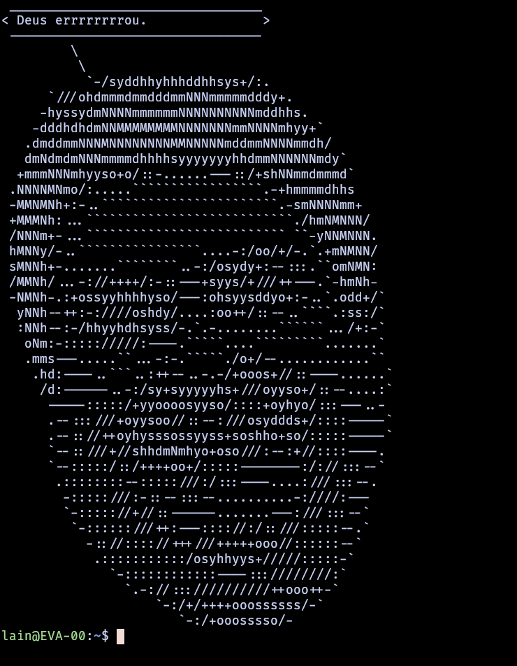

# Final work for the Linguagens Formais e Automatos course from the Universidade Federal do Rio Grande do Sul.



## Dependencies

- Python3.9
- playsound python module

## How to use:

### parser.py
```
usage: parser.py [-h] [-v] grammar

Sentence parser: returns if given sentences are part of the language described
in given grammar file.

positional arguments:
  grammar        path to file containing the grammar to be used

optional arguments:
  -h, --help     show this help message and exit
  -v, --verbose  print parsing steps
```

### generator.py
```
usage: generator.py [-h] [-f path] grammar

Sentence generator: generates a sentence from the language described in given
grammar file.

positional arguments:

optional arguments:
  -h, --help     show this help message and exit
  -g grammar     path to file containing the grammar to be used
  -f path        path to directory containing .wav files named accordingly
                 with the terminal they represent
```

The script `generator.py` depends on the module `pyaudio` to play audios.
To install use `pip install pyaudio`. You can still run the script without
this module, but no audios will be played.

## How to faustosay
```
./generator.py -f ./audios/fausto/ -g ./grammars/fausto.gr | ./faustaosay.py
```
